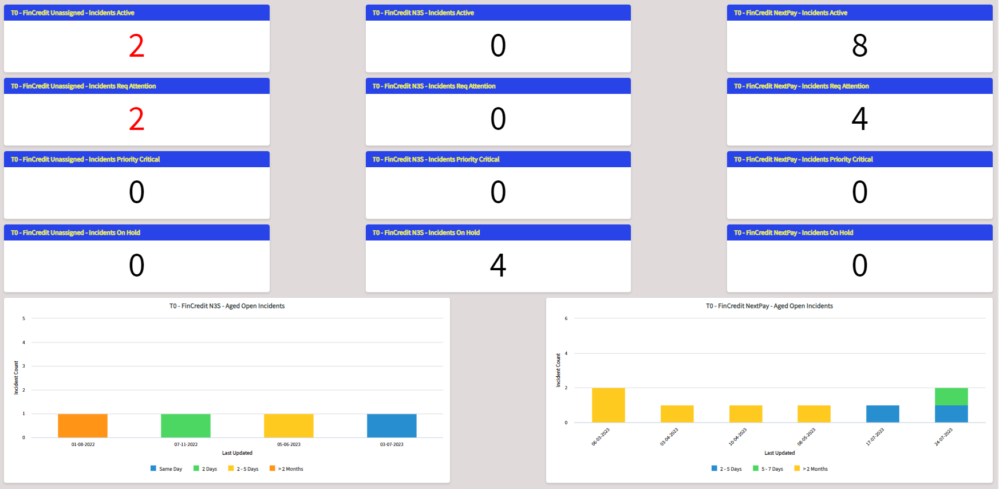

up:: [[Next Retail]]

# Next Dashboard

### Subject:  FinCredit Team Dashboard

### Theme: How to Use It

- Description, Illustration - describe every element
	- Any Number in Red
		- Unassigned
		- Priority 1
	- Active Workload
	- Req Attention

	- Charts
		- N3S - Four Incidents on Hold each column is height 1 and Hold is 4. There are two that are rather old (from last year), however one has been updated recently so it is progressing
		- NextPay - Not as old as N3S Incidents, but there are 5 Incidents over two months old and that have not had any comments since then. The incidents are not being followed or appear to be so. Why are there five incidents that are over two months old and have not had any updates for over two months? I would click on the yellow boxes to see which incidents are not progressing.

So the agenda for work is 
- Assign ownership of the new Incidents to someone 
- Respond to the four incidents awaiting a reply from the team
- Target all the aged incidents that are orange or yellow, as they have been stagnating for over two months. Investigate the oldest aged incidents to find out why they are not progressing and update the incidents with the investigation results. Try, at least, to change the color of the aged incidents from orange/yellow to green/blue

	 -------------------

Hi Everybody,

I have just shared the Finance Credit Team Dashboard. This dashboard is a tool, that used correctly provides the two teams of Finance Credit Systems, N3S and NextPay, with a better visibility of which incidents need to be prioritised and those that are stagnating and need some attention in order to progress.

I have taken a picture of today's dashboard and will now illustrate how to "read" it and then determine a targeted work agenda for progressing the open incidents. The following is a snapshot of today's Finance Credit Team Dashboard:

 

Upon opening the dashboard, I will immediately pay attention to the numbers in red. A number will appear red if it represents either:

- an incident that has not been assigned to either Team; these are usually "new" incidents but could also include incidents that although assigned to Finance Credit Systems are not assigned to a member of either Team. This could happen when an incident previously assigned to a member of the team has still not been resolved and then the member leaves the team. The incident has lost ownership and needs to be reassigned to a new person in the team.

- an open incident that has priority "Critical"

Then, I will glance at the numbers in the top row, the "Active Incidents", simply to get an idea of the workload on hand.

However, I will give more attention to the second row, the "Incidents Requiring Attention". These are incidents for which the last update was posted by someone not a member of the team and therefore, we can assume, is requiring some sort of response from our Team. By double clicking on the number in the box, I can view a list of the corresponding incidents in the standard table row format.

Finally, I will look at the charts. The Charts help identify the "stagnating" incidents that are not progressing. Let's look at the given examples:

- N3S Aged Open Incidents - I can see four incidents on the chart, these correspond to the four Incidents On Hold. However, I can see that two of these incidents are quite quite old, from last year, which begs the question "why haven't they been yet resolved?", "what is preventing progress?" One of the incidents is coloured green, which means (refer to legend on chart) it was updated two days ago; good! someone is looking into the matter. But the oldest incident is coloured orange which means that the last update was over two months ago; this is not good! The situation needs to be investigated. By double clicking on the orange rectangle, I can find out the corresponding incident.

- NextPay Aged Open Incidents - the eight Active Incidents are shown on the chart. There are no Incidents On Hold; for this reason there are no extremely old incidents like there are for the N3S Team. However, I can immediately see that there are five "stagnating" incidents which is more than 50% of the Active Incidents. They are all over two months old and likewise the last updates were over two months ago. Clearly, someone is not paying attention to these incidents. Pro-active effort is needed to see what is going on, and to, at least, update the incidents with more current information.

Now, with the above information, I can establish a working agenda for the NextPay Team:

- Look at the New Incidents and take immediate ownership if appropriate 

- Respond to the four incidents awaiting for a reply from the team

- Target all the aged incidents that are orange or yellow, as they have been stagnating for over two months. Investigate the oldest aged incidents to find out why they are not progressing and update the incidents with the investigation results. Try to resolve the incidents or at least, to change the color of the aged incidents from orange/yellow to green/blue, that is update them.

Regards

Michael

PS    Verify that you can access the Dashboard and Widgets. If you can't I need to give you a personalised share as you are probably not registered as part of the Finance Credit System group. Just let me know.

Any feedback for improvement is welcome, just note that a separate Dashboard for Business/Management is in the pipeline.